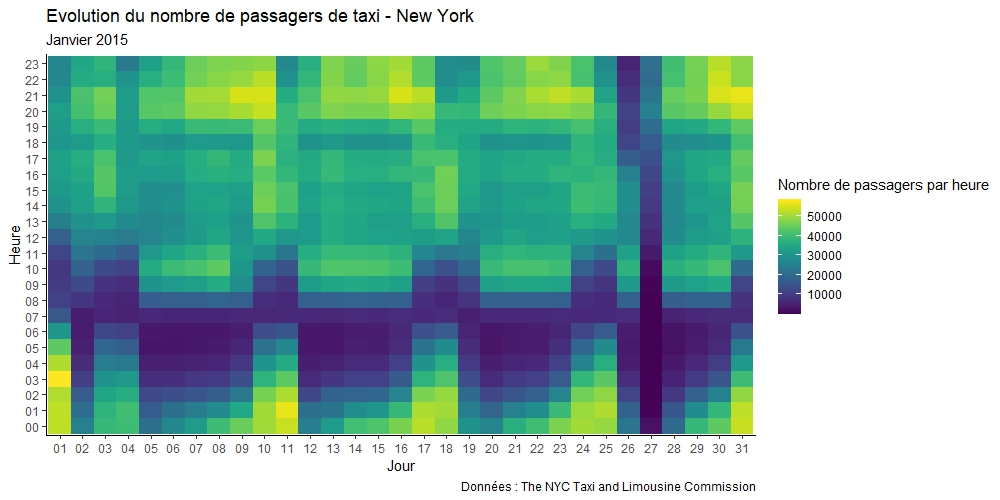
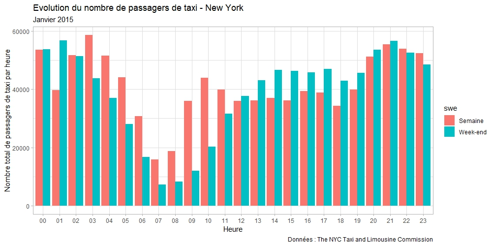
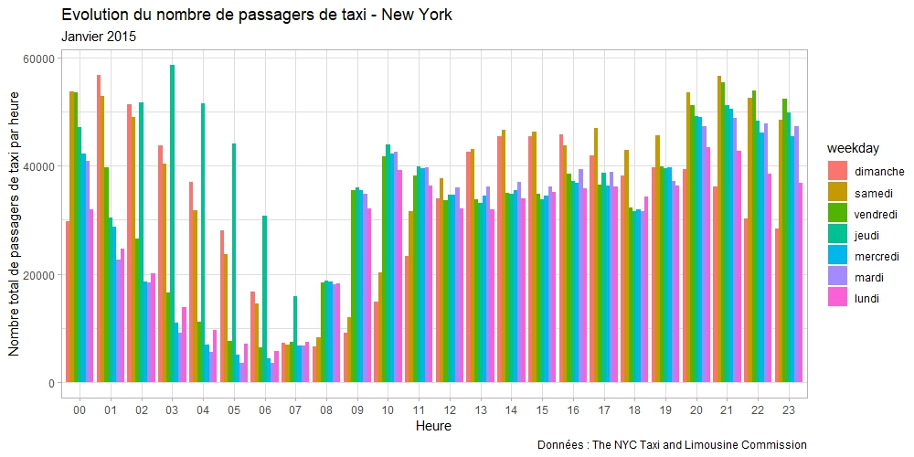

# Analysis of taxi traffic in New York: Observations and smoothing in R 

### Project goal : 
Analysis and smoothing of a time series of taxi traffic in New York (dataset : https://www.kaggle.com/datasets/julienjta/nyc-taxi-traffic)

### Statistical methods used :
Holt-Winters smoothing, moving averages, BOX-COX transformation, profile method, band method, Buys-Ballot test, simple linear regressions

### Libraries used :
ggplot2, lubridate, viridis, timeDate, car, viridis.

### Examples of charts created:

